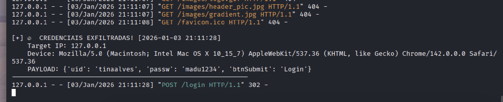

# 🎣 ShadowPortal - Advanced Phishing & Credential Harvester

> **Status:** ✅ Educational / Red Team Operations

## 🕵️‍♂️ Sobre o Projeto
O **ShadowPortal** é uma suíte de Engenharia Social desenvolvida em Python para demonstrar como ataques de *Phishing* modernos funcionam e como defender usuários. O projeto simula a infraestrutura completa de um ataque: da clonagem do site à exfiltração de dados através de túneis de rede.

A ferramenta opera em três estágios (Cyber Kill Chain):
1.  **Clonagem (Mirroring):** Copia fielmente a interface de um alvo legítimo (HTML/CSS).
2.  **Exfiltração (Harvesting):** Intercepta requisições POST, captura credenciais e realiza *fingerprinting* do dispositivo da vítima.
3.  **Tunneling & Delivery:** Expõe o servidor local (`localhost`) para a internet pública, burlando NAT e Firewalls.

## ⚙️ Arquitetura Técnica

* **Engine de Clonagem:** Utiliza `requests` e `BeautifulSoup` para raspar (scrape) o HTML alvo e injetar o *payload* de redirecionamento.
* **Servidor C2 (Command & Control):** Backend leve em `Flask` que atua como listener para receber dados exfiltrados em tempo real.
* **Forense Digital:** Captura metadados da conexão (IP de Origem, User-Agent, Timestamp) para análise de acesso.

## ☁️ Infraestrutura de Entrega (Network Tunneling)
Para expor o servidor de ataque à internet pública sem necessidade de configurações complexas de rede (Port Forwarding), foi implementado o **Cloudflare Tunnel (`cloudflared`)**.

O fluxo de conexão demonstrado no projeto:
1.  **Atacante (Kali Linux):** Roda o servidor Flask na porta 5000.
2.  **Túnel Seguro:** A Cloudflare cria uma ponte criptografada (`trycloudflare.com`) conectando o localhost à web.
3.  **Engenharia Social:** O link final é mascarado com encurtadores (ex: Bitly) utilizando técnicas de *Typosquatting* para aumentar a taxa de cliques.

## 🛡️ Análise de Defesas
Durante os testes de laboratório contra alvos reais (como Instagram/Facebook), foram mapeadas as seguintes defesas modernas:
* **SPA (Single Page Applications):** Sites modernos feitos em React/Angular dificultam a clonagem estática simples.
* **Client-Side Encryption:** Plataformas como o Facebook criptografam a senha no navegador (parâmetro `encpass`) usando chaves públicas antes do envio, mitigando ataques de *Man-in-the-Middle*.

## 📸 Proof of Concept (PoC)

*(Demonstração de ataque cross-platform: Servidor rodando em Kali Linux capturando credenciais de uma vítima acessando via MacOS através de um link público)*

## ⚠️ Disclaimer & Ética
Este software foi desenvolvido estritamente para **fins educacionais e testes de intrusão autorizados**.
* O uso contra sistemas sem consentimento prévio é ilegal.
* A desenvolvedora não se responsabiliza pelo mau uso desta ferramenta.

---
Desenvolvido por **Heloísa Madureira** 💀
